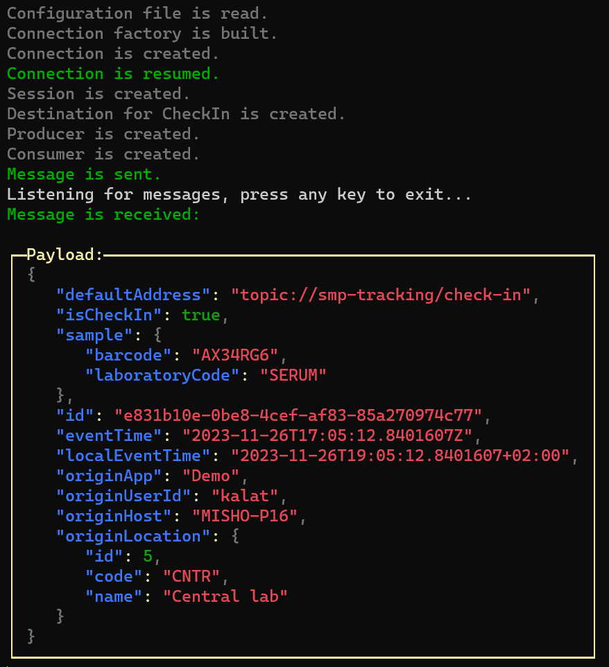

## Getting started

### Dependencies

 


### Example code

Here is the demo application:
```cs
// Configuration
IConfigurationRoot conf = BuildConfig();
AnsiConsole.MarkupLine("[gray]Configuration file is read.[/]");

// Connection factory
IConnectionFactory factory = new NMSConnectionFactory(new Uri(conf[KEY_URI] ?? throw new ApplicationException($"Missing key {KEY_URI} in {SETTINGS_FILE}.")));
AnsiConsole.MarkupLine("[gray]Connection factory is built.[/]");

// Connection
using IConnection connection = factory.CreateConnection(
    conf[KEY_USER] ?? throw new ApplicationException($"Missing key {KEY_USER} in {SETTINGS_FILE}."),
    conf[KEY_PASSWORD] ?? throw new ApplicationException($"Missing key {KEY_PASSWORD} in {SETTINGS_FILE}."));
AnsiConsole.MarkupLine("[gray]Connection is created.[/]");

connection.ConnectionInterruptedListener += () => AnsiConsole.MarkupLine($"[red1]Connection is interrupted.[/]");
connection.ConnectionResumedListener += () => AnsiConsole.MarkupLine($"[green3]Connection is resumed.[/]");
connection.ExceptionListener += (Exception exception) => AnsiConsole.MarkupLine($"[red1]Exception: {exception.Message}.[/]");

// Session
using ISession session = connection.CreateSession(AcknowledgementMode.ClientAcknowledge);
AnsiConsole.MarkupLine("[gray]Session is created.[/]");

// Destination
using IDestination destination = SessionUtil.GetDestination(session, new CheckIn().DefaultAddress); // Samples check in and out address
AnsiConsole.MarkupLine($"[gray]Destination for {nameof(CheckIn)} is created.[/]");

// Producer
using IMessageProducer producer = session.CreateProducer(destination);
producer.DeliveryMode = MsgDeliveryMode.Persistent;
producer.RequestTimeout = TimeSpan.FromSeconds(10);
AnsiConsole.MarkupLine("[gray]Producer is created.[/]");

// Consumer
using IMessageConsumer consumer = session.CreateConsumer(destination);
consumer.Listener += new MessageListener((IMessage message) =>
{
    AnsiConsole.MarkupLine($"[green3]Message is received:{Environment.NewLine}[/]");
    AnsiConsole.Write(
    new Panel(new JsonText(((ITextMessage)message).Text))
        .Header("Payload:")
        .Collapse()
        .RoundedBorder()
        .BorderColor(Color.Yellow));
});
AnsiConsole.MarkupLine("[gray]Consumer is created.[/]");

connection.Start();

// Send a message
CheckIn checkIn = new()
{
    OriginApp = "Demo",
    IsCheckIn = true,
    Sample = new Sample() { Barcode = "AX34RG6", LaboratoryCode = "SERUM" },
    OriginHost = Environment.MachineName,
    OriginLocation = new Location() { Id = 5, Name = "Central lab", Code = "CNTR" },
    OriginUserId = Environment.UserName,
};
ITextMessage msg = session.CreateTextMessage(JsonSerializer.Serialize(
    checkIn,
    checkIn.GetType(),
    new JsonSerializerOptions() { WriteIndented = true, PropertyNamingPolicy = JsonNamingPolicy.CamelCase, DefaultIgnoreCondition = System.Text.Json.Serialization.JsonIgnoreCondition.WhenWritingNull }));
msg.NMSCorrelationID = Guid.NewGuid().ToString();
msg.Properties["NMSXGroupID"] = "System";
msg.Properties["myHeader"] = "iLab";
producer.Send(msg);
AnsiConsole.MarkupLine($"[green3]Message is sent.[/]");

AnsiConsole.MarkupLine("Listening for messages, press any key to exit...");
Console.ReadKey();
connection.Stop();
```

This application produces the following output:


