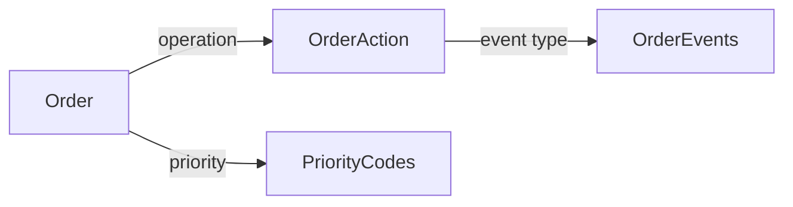

The main order contracts and their supporting values are related as follows:

```mermaid
flowchart LR
    Order[Order] -->|operation| Action[OrderAction]
    Action -->|event type| Events[OrderEvents]
    Order -->|priority| Priority[PriorityCodes]
```
